# Efoy

Efoy is a shared commuting platform built for students and civil servants in Addis Ababa.

The idea is simple: trusted taxi and Yango drivers operate on fixed routes and schedules, more like small shuttles than on-demand rides. Riders can track trips live, confirm pickups, and if a vehicle breaks down, the system can assign a replacement so the trip can continue with as little disruption as possible.

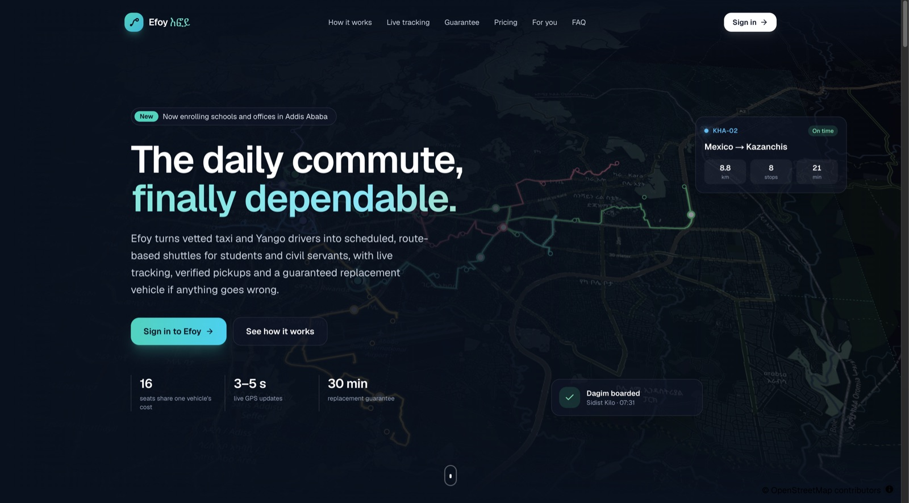

## Screenshots

### Landing page

The landing page introduces the service using real Addis Ababa routes and map-based trip visuals.

| | |
| --- | --- |
| 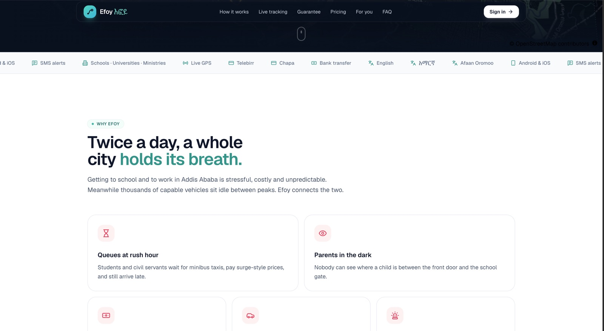 | 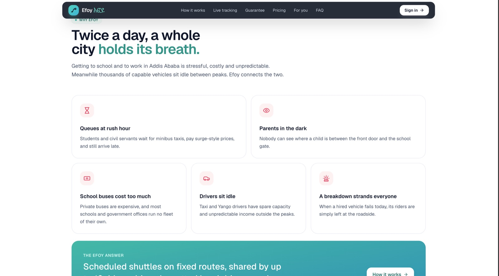 |
| Payments, supported languages, and communication channels | The main commuting problems Efoy is designed to solve |
| 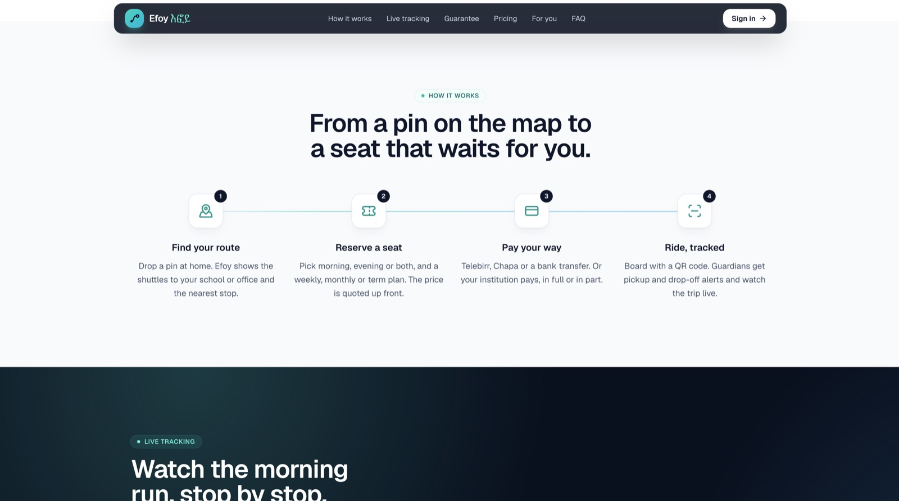 | 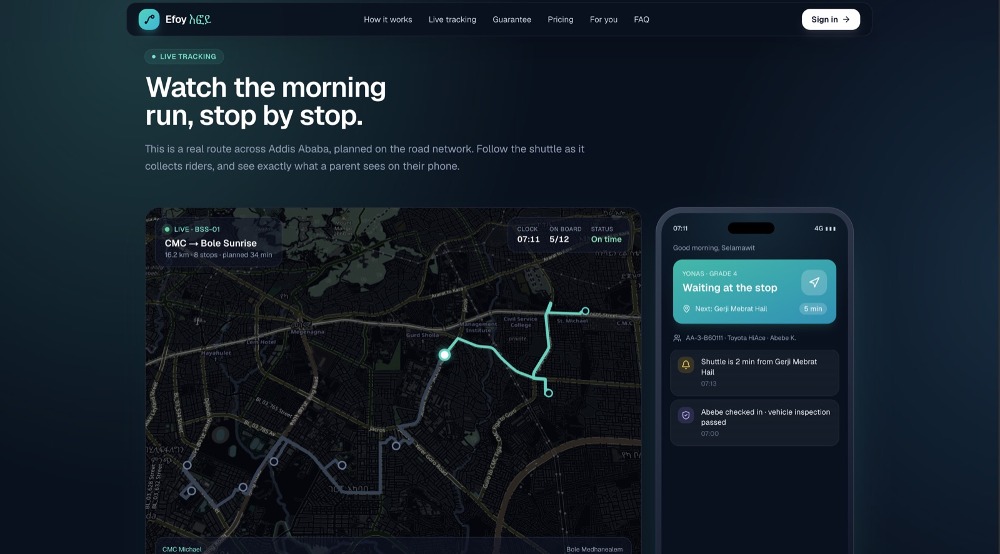 |
| From choosing a pickup point to reserving a seat | Live trip tracking synced with the parent experience |
| 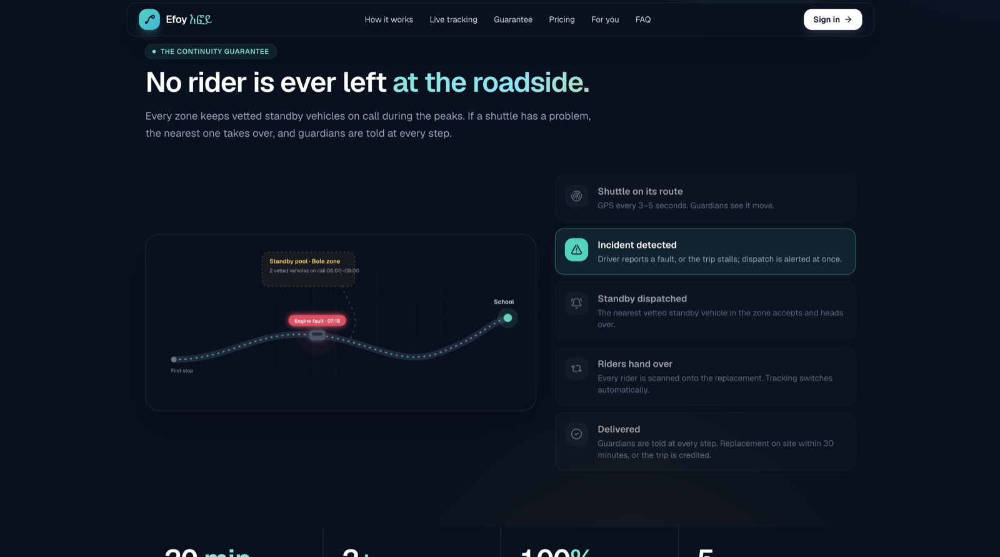 | 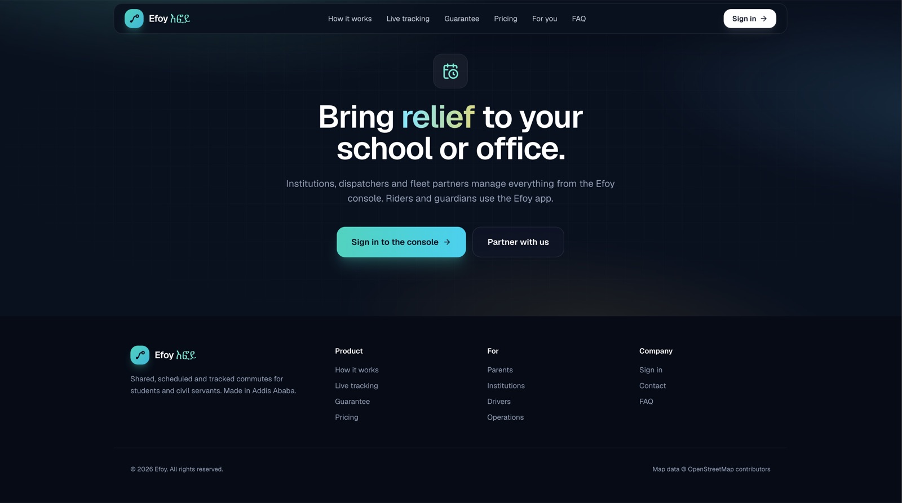 |
| A standby vehicle can take over if a shuttle breaks down | Entry point to the Efoy console |

### Console

The console is used by operations teams and institutions. The screenshots below show the system from a school administrator's view.

| | |
| --- | --- |
| 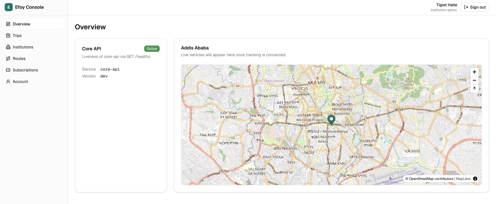 | 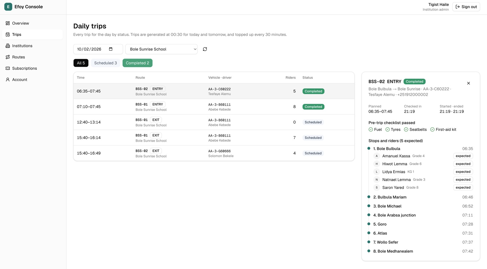 |
| System overview, API status, and city map | Daily trips, stops, riders, and trip checklist |
| 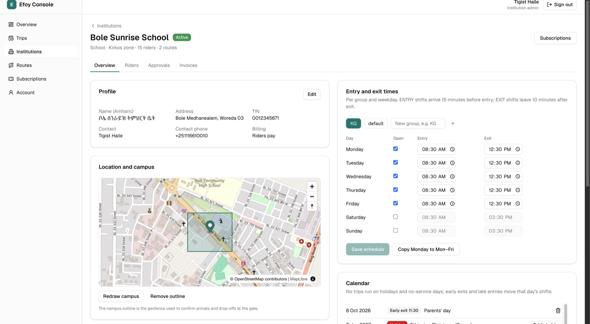 | 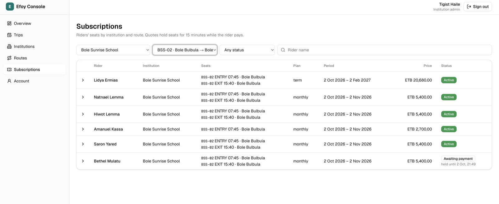 |
| Institution details, campus geofence, and timetable | Rider subscriptions, seat assignments, and payment status |

## Project structure

| Path | Purpose |
| --- | --- |
| `cmd/` | Contains the five Go services: `core-api`, `tracking-ingest`, `realtime-gateway`, `dispatch-engine`, and `workers` |
| `internal/` | Main business logic such as IAM, trips, boarding, and application wiring |
| `pkg/` | Shared libraries that are not tied to a specific business domain |
| `api/openapi/efoy.yaml` | Main REST API contract used to generate server and client code |
| `db/migrations/` | Database migrations managed with goose. `0001_init.sql` contains the full v1 schema |
| `db/queries/` | SQL queries used by sqlc |
| `web/` | Next.js application for the operations console and institution portals |

## Requirements

Before running the project, make sure you have:

- Go 1.26 or later
- Node.js 20.9 or later
- Node.js 22 recommended, based on `web/.nvmrc`
- Docker
- `golangci-lint` v2 for `make lint`

## First-time setup

Start by creating your local environment file:

```sh
cp .env.example .env
```

Then install the required tools, dependencies, and generated files:

```sh
make bootstrap
```

This prepares the Go dependencies, generated API/database code, `go.sum`, and the frontend dependencies.

After bootstrap, make sure these generated files are committed:

```sh
git add go.mod go.sum internal/api/apigen internal/db web/package-lock.json
```

CI expects `go.sum` and `web/package-lock.json`, and it also checks that generated code is up to date.

## Running Efoy locally

Start the supporting services first:

```sh
docker compose up -d
```

This starts PostgreSQL with PostGIS and TimescaleDB, Redis, NATS, S3-compatible storage, and OSRM.

Then run the application:

```sh
make dev
```

This applies the database migrations and starts all backend services together with the web console using hot reload.

Main local endpoints:

- Web console: `http://localhost:3000`
- Core API health: `http://localhost:8080/healthz`
- Core API readiness: `http://localhost:8080/readyz`
- Tracking ingest: `:8081`
- Realtime gateway: `:8082`
- Dispatch engine: `:8083`
- Workers: `:8084`
- S3 storage console: `http://localhost:9001`
- OSRM: `http://localhost:5000`

The S3 development credentials are:

```text
Username: efoy
Password: efoy-dev-secret
```

### A note about OSRM

The first time you run Docker Compose, OSRM downloads and prepares the Ethiopia OpenStreetMap data.

The download is around 140 MB, and preprocessing can take anywhere from a few minutes to much longer depending on the machine and internet connection.

If you do not want to wait for OSRM during development, you can disable it temporarily:

```sh
EFOY_OSRM__URL=
```

When OSRM is disabled, Efoy falls back to straight-line route estimates.

## Testing

Before running the full test suite, apply the database migrations:

```sh
make migrate-up
```

Then run:

```sh
make test
```

The test suite includes database-level tests as well.

One example is the subscription overbooking test, where 50 parallel quote requests compete for the final available seat. This helps verify that seat allocation remains correct under concurrency.

## Useful commands

You can see all available commands with:

```sh
make help
```

Some commonly used targets are:

```sh
make test
make lint
make generate
make migrate-new name=your_migration_name
make mock
```

`make mock` starts a mock API from the OpenAPI specification on port `4010`.
